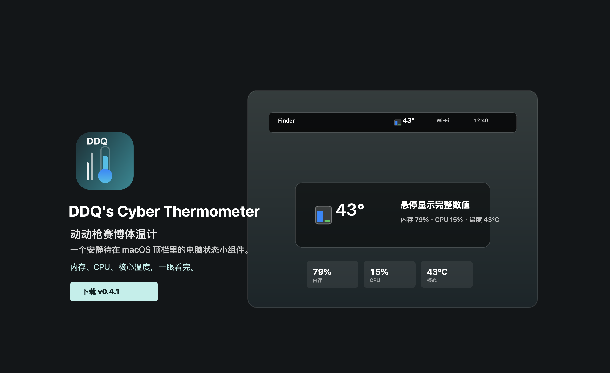
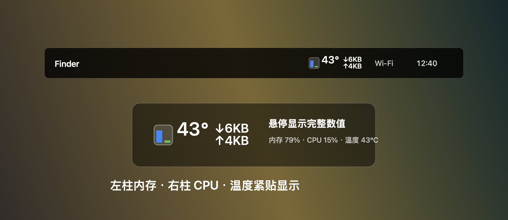

# DDQ's Cyber Thermometer

中文名：**动动枪赛博体温计**。

一个安静待在 macOS 顶栏里的赛博体温计。内存、CPU、核心温度，一眼看完。



## 下载

公开版本会放在 GitHub Release：

- 下载最新版：`Releases` 页面里的 `DDQs-Cyber-Thermometer-0.4.1.dmg`
- 当前版本：`v0.4.1`
- 许可证：MIT

安装方式：打开 DMG，把 `动动枪赛博体温计.app` 拖到 `Applications`。

> 当前安装包是本地临时签名，未做 Apple Developer ID 公证。首次打开时如遇到系统拦截，可右键 App 选择“打开”，或到“系统设置 > 隐私与安全性”里允许打开。

## 它显示什么



- 左侧蓝色迷你柱：内存占用率
- 右侧绿色迷你柱：CPU 占用率
- 紧贴的数字：核心温度
- 鼠标悬停：显示完整的内存、CPU、核心温度
- 点击菜单：显示风扇当前转速，支持开机启动、检查更新、刷新或退出

## 介绍页面

静态介绍页在：

```text
docs/index.html
```

推到 GitHub 后可以直接启用 GitHub Pages，发布 `docs/` 目录。

## 本地打包

```bash
cd /Users/zhanglongxin/Desktop/longxincode/mac-health-guardian
chmod +x Scripts/build-app.sh Scripts/package-dmg.sh
Scripts/package-dmg.sh
```

生成：

```text
dist/DDQs-Cyber-Thermometer-0.4.1.dmg
dist/DDQs-Cyber-Thermometer-0.4.1.dmg.sha256
dist/DDQs-Cyber-Thermometer-0.4.1.app.zip
dist/DDQs-Cyber-Thermometer-0.4.1.app.zip.sha256
```

只构建 App：

```bash
Scripts/build-app.sh
open "build/动动枪赛博体温计.app"
```

终端采样：

```bash
".build/release/MacHealthGuardian" --sample
```

## 温度说明

Apple Silicon 机器会优先读取系统里的 `PMU tdie` 温度传感器，并取最高核心温度显示。其他机型或读取失败时，会自动尝试本机已安装的命令：

- `osx-cpu-temp`
- `istats`
- `smc`

如果直接读取和外部命令都失败，顶栏温度会显示 `--`，但内存和 CPU 仍会正常显示。

## 风扇说明

v0.2.1 起，点击顶栏图标后菜单会显示风扇当前转速。工具会优先读取 AppleSMC 风扇键，失败时尝试 `istats` 或 `smc` 命令。

部分 Apple Silicon 机型没有风扇，或系统不向普通 App 暴露风扇转速；这时菜单会显示 `无风扇` 或 `未读取`。

## 在线升级

v0.3.0 起，点击顶栏图标后可以选择“检查更新…”。工具会读取 GitHub 最新 Release，比对当前版本，显示更新内容。

v0.4.0 起，App 内更新会优先下载 `.app.zip`，校验 SHA256，并在退出当前 App 后自动替换安装、重新打开；如果 Release 没有 zip 更新包，会回退到 DMG 更新流程。

v0.4.1 起，检查更新不再依赖 `api.github.com`，避免 GitHub 匿名 API 频率限制导致 HTTP 403。

如果自动安装因为权限或运行位置失败，工具会打开下载好的更新包，用户仍可手动安装。

## 开机启动

v0.4.0 起，点击顶栏图标后可以勾选“开机启动”。这个设置使用 macOS 登录项能力，不需要额外后台进程。

## 发布到 GitHub

本机需要先登录 GitHub CLI：

```bash
gh auth login
```

然后运行：

```bash
Scripts/publish-github.sh
```
